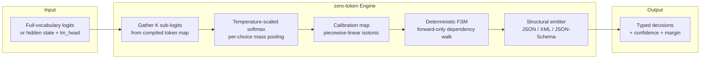
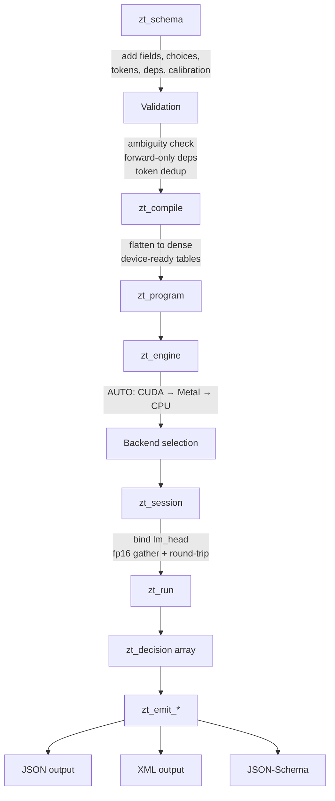
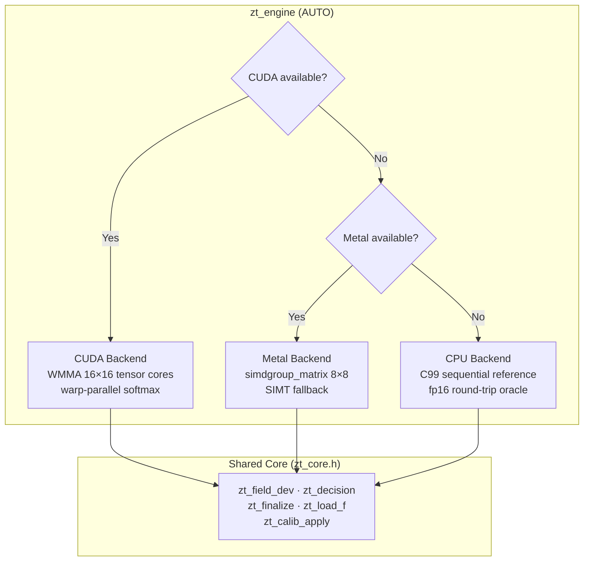
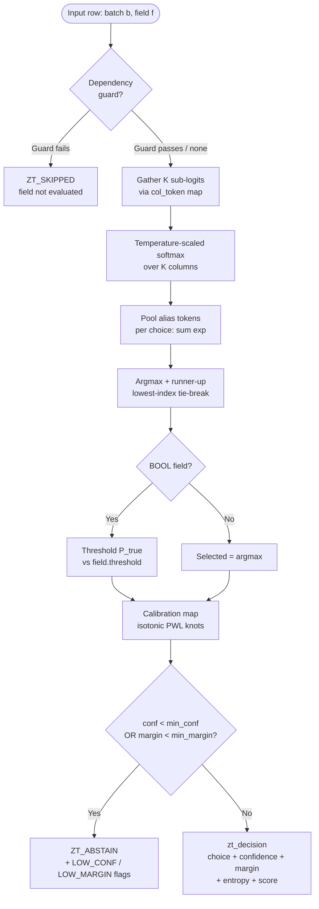

```
┌──────────────────────────────────────────────────────────────────────┐
│                                                                      │
│   ███████╗███████╗██████╗  ██████╗       ████████╗ ██████╗ ██╗  ██╗  │
│   ╚══███╔╝██╔════╝██╔══██╗██╔═══██╗      ╚══██╔══╝██╔═══██╗██║ ██╔╝ │
│     ███╔╝ █████╗  ██████╔╝██║   ██║  █████╗ ██║   ██║   ██║█████╔╝  │
│    ███╔╝  ██╔══╝  ██╔══██╗██║   ██║  ╚════╝ ██║   ██║   ██║██╔═██╗  │
│   ███████╗███████╗██║  ██║╚██████╔╝         ██║   ╚██████╔╝██║  ██╗ │
│   ╚══════╝╚══════╝╚═╝  ╚═╝ ╚═════╝          ╚═╝    ╚═════╝ ╚═╝  ╚═╝ │
│                                                                      │
│   Zero-text-generation decision engine                               │
│   Single forward pass · Deterministic FSM · Typed decisions          │
│                                                                      │
└──────────────────────────────────────────────────────────────────────┘
```


---

## What is zero-token?

**zero-token** is a structured decision engine that **never generates text**. Given a language model's next-token distribution — full-vocabulary logits or a hidden state plus lm_head — it produces typed decisions in a single forward pass through a constrained linear head, deterministic finite-state machine, and calibrated confidence layer.

No autoregressive loop. No beam search. No sampling. One pass → one decision.

### Field Types

| Type | Output | Decision Rule |
|------|--------|---------------|
| **BOOL** | `true` / `false` | Thresholded on calibrated P(true) |
| **CHOICE** | One of N labels | Categorical argmax with alias-token pooling |
| **SCORE** | Numeric expectation | Weighted sum over N ordinal choice values |

Every decision carries: calibrated confidence, raw probabilities, log-margin, entropy, abstain flags, and dependency guards.

---

## Architecture



## Compilation Pipeline



## Backend Dispatch



## Decision Pipeline (per row)



---

## Project Structure

```
zero-token/
├── include/
│   ├── zt.h               Public C99 API — schema → compile → engine → session → run → emit
│   ├── zt_device.h         Target abstraction: Metal / CUDA / C99 host macros
│   ├── zt_core.h           Shared decision core — compiles unchanged on all 3 targets
│   └── zt_internal.h       Private host declarations — zt_program, zt_backend_ops vtable
│
├── src/
│   ├── zt_engine.c         Engine/session lifecycle, AUTO backend selection
│   ├── zt_schema.c         Schema builder + zt_compile (validate → flatten → dense tables)
│   ├── zt_cpu.c            C99 reference backend — correctness oracle for GPU paths
│   ├── zt_fsm.c            Deterministic routing walk — single ordered pass, idempotent
│   ├── zt_emit.c           Structural emitters (JSON / XML / JSON-Schema)
│   ├── zt_calib.c          Offline calibration: golden-section NLL + pool-adjacent-violators
│   ├── zt_metal.mm         Metal host bridge (metal-cpp) — 5 pipelines, zero-copy shared memory
│   └── zt_metal_arc.m      Metal host bridge (ObjC ARC) — library resolution, SIMD probe
│
├── kernels/
│   ├── zt_kernels.cuh      CUDA device code — WMMA 16×16 tiles, warp-parallel softmax+argmax
│   ├── zt_kernels.metal    Apple Silicon MSL — simdgroup_matrix 8×8, SIMT fallback
│   └── zt_kernels.metal.h  Embedded MSL source as raw string literal (metal-cpp path)
│
├── ffi/
│   ├── python/zt.py        ctypes bindings — Schema, Engine, Session, Result classes
│   └── rust/lib.rs         Rust FFI — Schema, Engine, Session, ResultBuf with Drop impl
│
├── tests/
│   └── test_zt.c           Correctness suite — logits, hidden, aliases, abstain, emitters,
│                            calibration, fp16 round-trips, GPU vs CPU cross-check
│
├── bench/
│   └── bench.c             Throughput harness — logits (rows×32000) and hidden (rows×H) paths
│
└── tools/
    └── claimguard/         ClaimGuard CLI scaffolding (separate verification tool)
```

---

## Key Design Decisions

| Decision | Rationale |
|----------|-----------|
| **No text generation** | Decisions are typed values, not token sequences — no hallucination surface |
| **Single forward pass** | No autoregressive loop — latency is O(1) not O(sequence length) |
| **Shared `zt_core.h`** | Same decision math on CPU, CUDA, and Metal — bit-exact cross-validation |
| **fp16 round-trip** | Head weights gathered through fp16 on all backends — GPU and CPU see identical values |
| **Deterministic tie-break** | Lowest-index wins — same input always produces same output across backends |
| **Isotonic calibration** | Pool-adjacent-violators ensures monotone probability mapping |
| **Forward-only deps** | FSM guards form a DAG — no cycles, single ordered evaluation pass |
| **Fail to abstain** | Low confidence or narrow margin → `ZT_ABSTAIN`, never a wrong forced choice |

## Target Abstraction (`zt_device.h`)

| Macro | Metal | CUDA | Host C99 |
|-------|-------|------|----------|
| `ZT_FN` | `static inline` | `__host__ __device__ __forceinline__` | `static inline` |
| `ZT_DEV` | `device` | *(empty)* | *(empty)* |
| `ZT_CONST` | `constant` | *(empty)* | *(empty)* |
| `ZT_THREAD` | `thread` | *(empty)* | *(empty)* |
| `ZT_EXPF` | `metal::precise::exp` | `expf` | `expf` |
| `ZT_F16_TO_F32` | native `half` cast | `__half2float` | IEEE manual decode (subnormals, inf, nan) |

---

## Build

### CPU-only (any platform)

```bash
cc -O2 -Iinclude src/zt_engine.c src/zt_schema.c src/zt_cpu.c \
   src/zt_fsm.c src/zt_emit.c src/zt_calib.c \
   tests/test_zt.c -lm -o test_zt
./test_zt
```

### With CUDA

```bash
nvcc -O2 -Iinclude -DZT_HAVE_CUDA \
     src/zt_engine.c src/zt_schema.c src/zt_cpu.c \
     src/zt_fsm.c src/zt_emit.c src/zt_calib.c \
     kernels/zt_kernels.cuh tests/test_zt.c -lm -o test_zt
```

### With Metal (macOS / Apple Silicon)

```bash
clang -O2 -Iinclude -DZT_HAVE_METAL -framework Metal -framework Foundation \
      src/zt_engine.c src/zt_schema.c src/zt_cpu.c \
      src/zt_fsm.c src/zt_emit.c src/zt_calib.c \
      src/zt_metal_arc.m tests/test_zt.c -lm -o test_zt
```

### Benchmark

```bash
cc -O2 -Iinclude src/zt_engine.c src/zt_schema.c src/zt_cpu.c \
   src/zt_fsm.c src/zt_emit.c src/zt_calib.c \
   bench/bench.c -lm -o bench
./bench
```

---

## FFI Bindings

### Python

```python
from zt import Schema, Engine, Session

schema = Schema()
field = schema.add_field("sentiment", Schema.CHOICE)
schema.add_choice(field, "positive", [1234, 5678])
schema.add_choice(field, "negative", [9012, 3456])

engine = Engine()
session = engine.session(schema.compile(), max_batch=32)
result = session.run_logits(logits_array)
print(result[0].choice, result[0].confidence)
```

### Rust

```rust
use zero_token::{Schema, Engine, Session};

let mut schema = Schema::new();
let field = schema.add_field("sentiment", Kind::Choice);
schema.add_choice(field, "positive", &[1234, 5678], 0.0);
schema.add_choice(field, "negative", &[9012, 3456], 0.0);

let program = schema.compile()?;
let engine = Engine::new(Backend::Auto)?;
let mut session = engine.session(&program, 32)?;
let results = session.run_logits(&tensor)?;
```

---

## License

Dual-licensed under [GPL-2.0](https://www.gnu.org/licenses/old-licenses/gpl-2.0.html) or [AGPL-3.0](https://www.gnu.org/licenses/agpl-3.0.html). See [LICENSE](LICENSE) for details.

Copyright (c) 2026 BEL ESPRIT D ACCORD.
